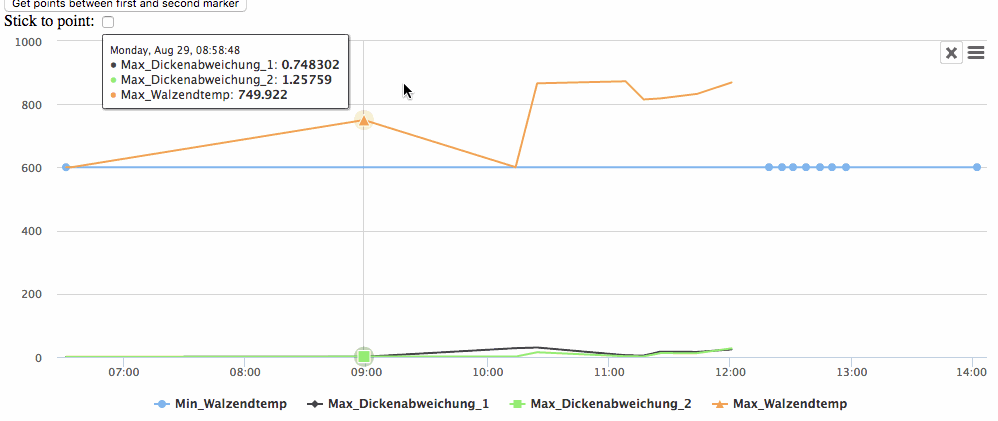
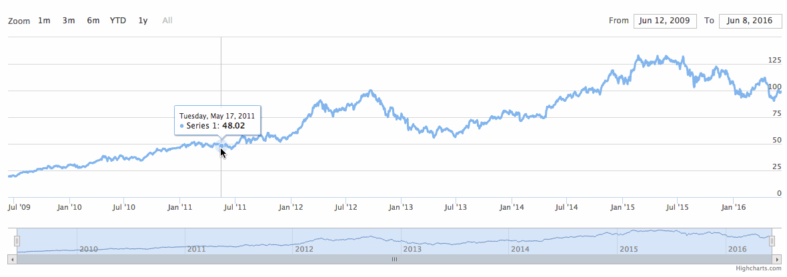

# Customization exercise 1

#### Tasks:

- [ ] - Recommend API, discuss it with the teacher
- [ ] - Estimate time needed to implement the customization below, send the estimate to the teacher
- [ ] - Wait for the green light from the teacher
- [ ] - Implement

If anything in the description is unclear, contact the teacher

## Interactive Rulers
Implement interactive rulers which can be easily added to the chart via click event. Each ruler consists of two parts: a vertical line and a label with rich info about the ruler.

#### Requirements:
- Highcharts version: v10+
- Browsers: Chrome (current), Firefox (current), Safari (current), Edge (current)

#### Feature list:

###### Basic:
- Add a ruler by click or touch
- Multiple rulers must be possible
- Add a flag to the end of the ruler that allows interactivity (refer to Fig 1.)
- X+Y displayed in the flag

###### Styling (configurable):
- Line styling:
  - Color
  - Width
  - Style (dotted, dashed etc)
- Flag Styling:
  - Font size
  - Font color
  - Border width
  - Border color
  - Background

###### Behaviour:
- Enable/Disable data point snapping (automatically snap ruler to the nearest data point)
- Handle graph resizing (e.g. browser’s window resize)
- Handle zooming and panning
- Touch:
  - Add ruler via touch action
  - Drag and drop ruler via swipe action
###### API:
- All styling should be possible via API
- Each marker should be accessible independently
- Each marker should contain detailed info:
  - x value
  - y value
- List of all points between two markers
- Optional: point (if added via snap)
- Required callbacks in API:
  - On marker add
  - On marker drop
  - On marker remove

  
  