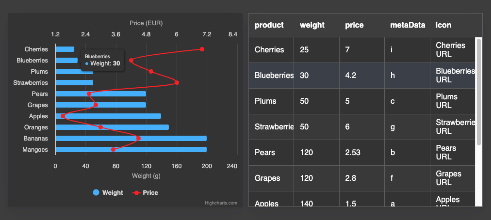

# Dashboards Exercise 1 - Dashboards Fundamentals

Create the Dashboard shown in the image below.
1. Create a dashboard containing two components: a Highcharts Component and a Datagrid Component.
2. Retrieve data from the data array already defined in the main.js file. Bind this data to the Datagrid.
3. Also, bind this data to the chart in such a way that the first series (bar) represents the weight of each product, and the second series (spline) represents its price. For clarity, these series should be attached to two different y-axes.
4. Set the color of the second series to red.
5. Transform the data so that it is sorted in ascending order based on weight (without changing the `data` array content).
6. Enable highlight synchronization.

(The image displays the dashboard in dark mode. The appearance will differ slightly if you use light mode.)