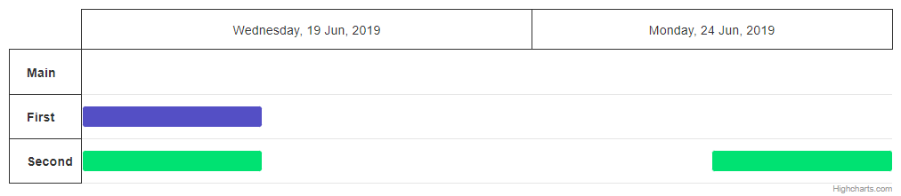

# Gantt Exercise 1 - Gantt Axes Groups

Open a chart from the `index.html` file.
Instead of two x-axes show only one with formatted labels like shown in the image below.
Group y-axis categories to show both points with the same name in the same category.

