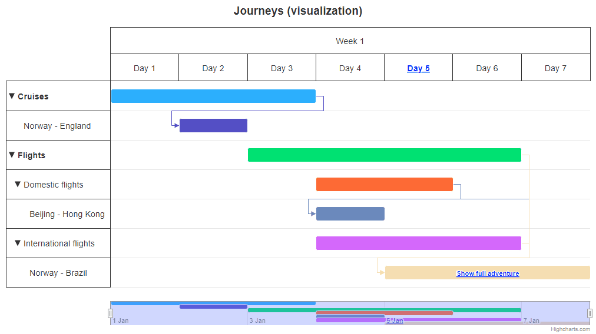

# Gantt Exercise 2 - Journeys Visualization

Open a chart from the `index.html` file with a default configuration showing a visualization of journeys. First, create a data structure, including the nested domestic/international flights shown in the attached gif. Based on your data, follow the next steps:

1. Adjust the x-axis to show a whole week, and format the day labels to Day 1, Day 2, Day 3...
2. Add a navigator, showing the whole series inside (from the first to the last point).
3. Add a drag and drop functionality in the x dimension (except the last point that shows the international flight), and follow the below rules:
   - A drag should be available only in a range of the x-axis.
   - The dropped element should always position itself in the range of a particular day (as shown in a gif).
   - There should be a gray shadow showing a place, where the element will be dropped (as shown in a gif).
4. The last point, showing the international flight, should have a drilldown, showing two flights before reaching the final destination. Follow the below rules:
   - After the drilldown, the navigator should show the displayed points (as shown in a gif).
   - After the drillup, the navigator should be backed to the previous state, showing the whole series.

What's not mentioned here (drilldown labels, etc.) should be added as shown in a gif.

