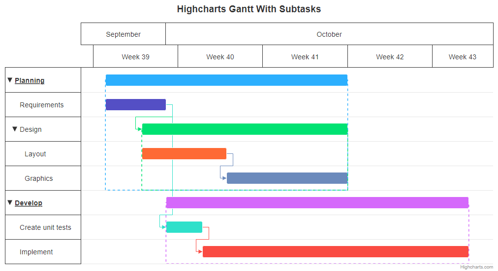

# Gantt Exercise 4 - Children-Parent Indicator

Create a dotted box around the group of points, which are in the relation parent-children. Take a look at the image for a reference.
The box should start in the middle of the parent, and should go around all of the children.

