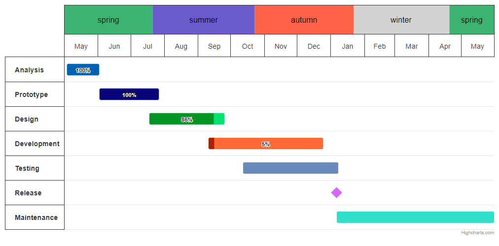

# Gantt exercise 3 - Seasons

Create a gantt chart with the seasons generated as in the attached image. The seasons are to be located in the place of the year and are to be dynamically generated, they should adapt to the change of min and max of the chart.

