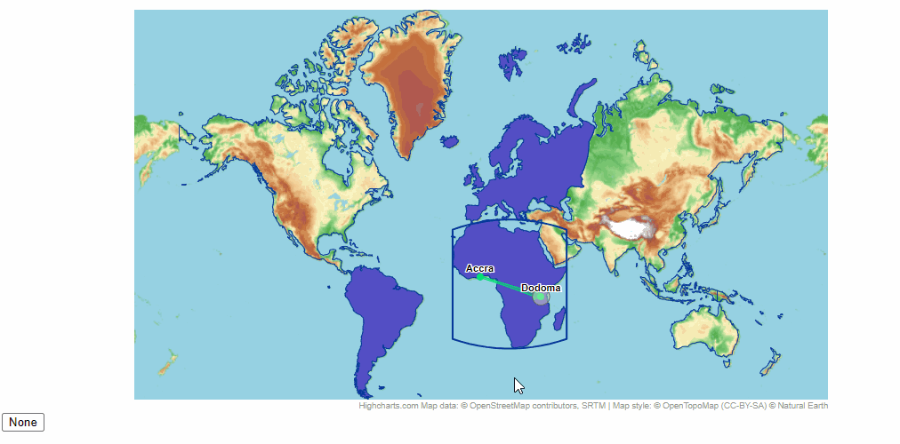

# Maps Exercise 2 - Maps Overview

Create the chart similar to the one from the gif following instructions step by step. Use Docs, API and blog articles to find the right series and methods.

- Modify the chart to add a projection to the map chart according to the latest guidelines.
- Set any projection.
- Add navigation using only the mouse wheel, without buttons.
- Add a Tiled Web Map series with any provider from the gif.
- Make continent borders visible and change their colors.
- Change the projection to the one that best suits the TWM series.
- Draw a polygon using any geometry around any continent different from the one in the gif.
- If your continent don’t have any data, add them
- Upon clicking a continent, adjust the map view to the drawn rectangle and make the continent's color more transparent.
- Add a button to reset the view to the previous view.
- Add two city points on the continent.
- Add a series illustrating a "flight" between the added cities (use the best series for this purpose).
- Use SVG.Renderer and add any shape on the map. Base its position on map coordinates (make the shape responsive as well).

