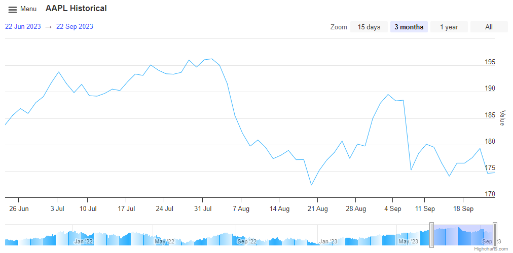

# Stock Exercise 1 - Stock Initial

Convert a basic chart into a stock chart. Modify the basic elements of the stock
chart to look like the image below. Pay attention to the position of range
selectors, the number of buttons, content, initial selection and appearance.
Also position the menu and title. Customize the navigation at the bottom to look
the same as the image.

