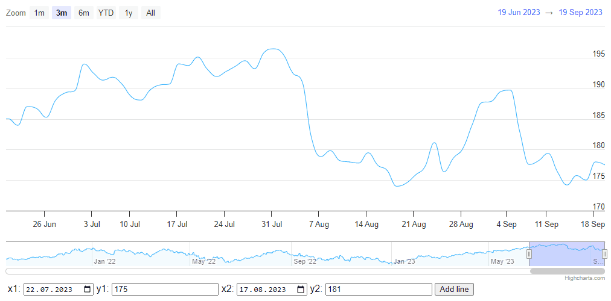

# Stock Exercise 6 - Annotations

Below the stock chart, create inputs that allow you to dynamically add `crookedLine` annotations. There should be a possibility to modify the annotation after adding it, so it will be necessary to add appropriate modules and a CSS file. Inputs should be limited to entering values from the chart, so after loading the chart you should add min and max attributes to the inputs extracted from the chart.

