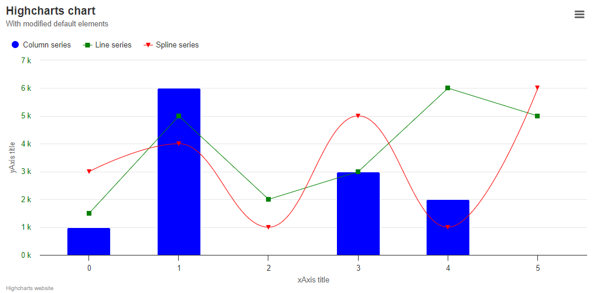

# highcharts/0-initial-chart

The first task is relatively simple, it is intended to show how to modify the basic chart elements and default settings. Pay attention to the position and content of the title, subtitle and credits. Move the legend, modify axis titles, formatting and styles. Change the default colors and symbols using the Highcharts built-in method to set options for all charts. Include 2 basic modules. The clues for them will be the menu in the upper right corner and a warning in the console.

