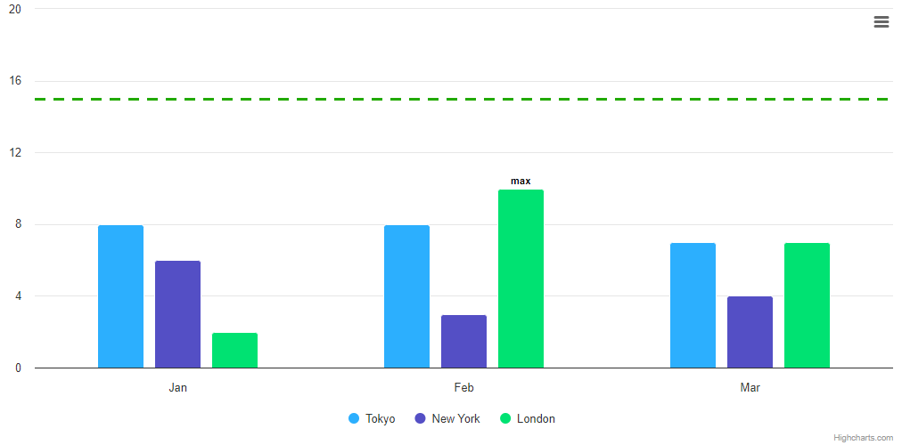

# Exercise 1 - Simple Column

Generate 3 column series with random integer data (0 <= y < 10). Find the highest column (or columns if few columns have the same value) and display the “max” label above.
Set `yAxis.max` to be exactly 2 times greater than the `y` of the max column. Try to figure out why sometimes `yAxis.max` isn't being taken into consideration and how to force Highcharts to set exactly the `yAxis.max` we want.
Add yAxis plotLine with a value of 1.5 \* the `y` of the max column.

