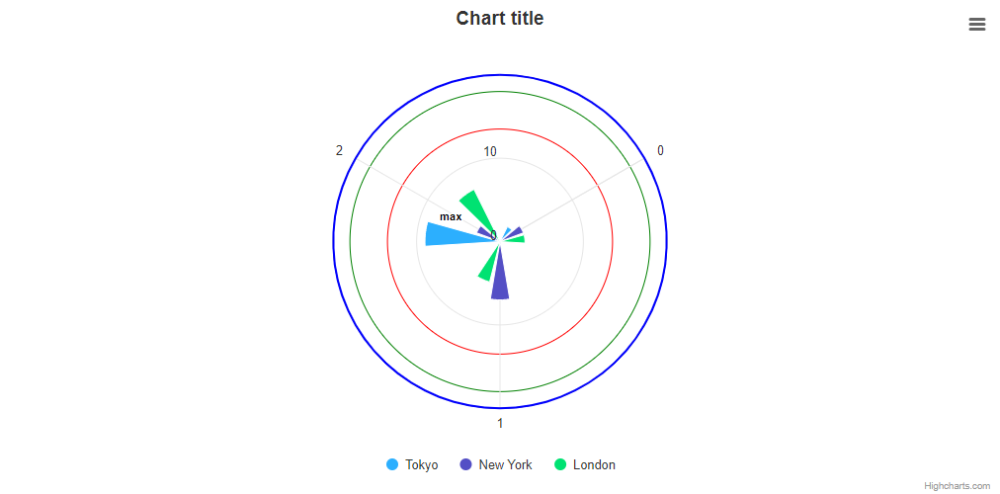

# Exercise 2 - Polar Rings

Based on the demo, that you created in the exercise 1, create a similar chart, but using the polar coordinates. Figure out additional ways of creating the additional circles in a different ways, similar to the ones, that you can use in the exercise below.

To achieve that, visit our [API reference page](https://api.highcharts.com/highcharts/).
Also you can visit our demo pages for some inspiration in drawing circles.

