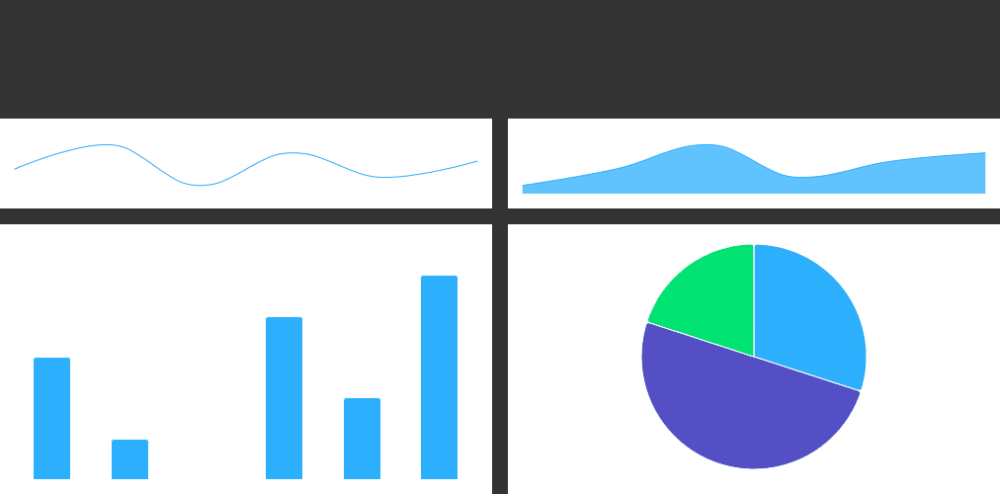

# Exercise 3 - Minimal Charts

Create 4 minimal charts that show only series without other chart elements, as in the gif below. Use CSS styles in such a way that the charts take up the available space in the parent element. Some chart options are common and some are individual, so use the method learned in the previous task. Also, take into account the formatting and behavior of the tooltip. Everything should be displayed in small charts and the formatting should be different for the pie chart.

