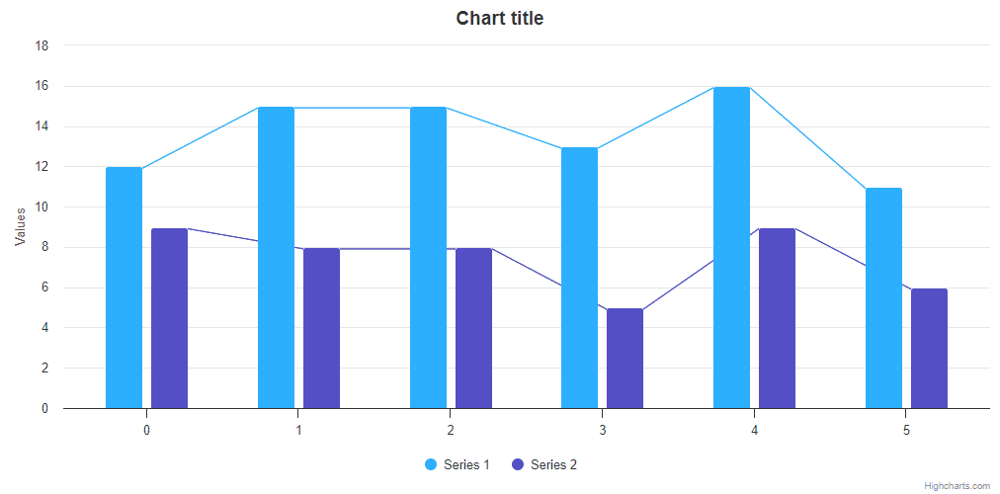

# Exercise 4 - Connecting Column Edges

Create a column chart with 2 series of random data. Render lines connecting columns’ corners like shown on the image below (rendered lines should toggle its visibility on legend click).

