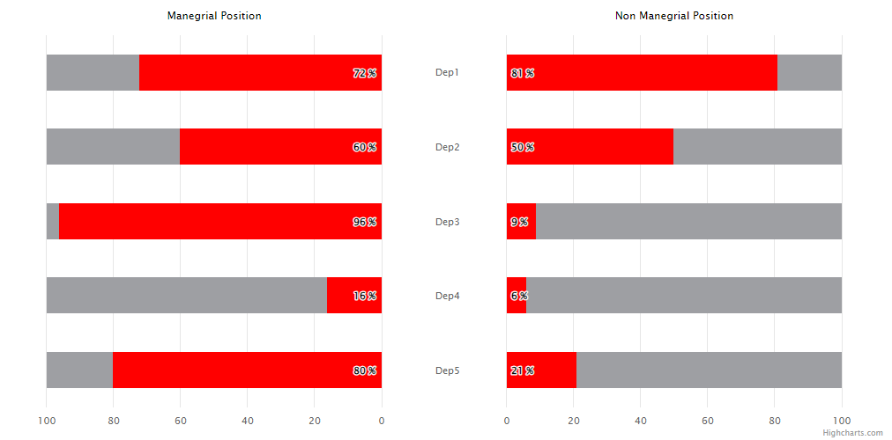

# Exercise 8 - Separate Axes

Create a bar chart with two separate red series on the separate axes. For reference, see the image below.

Remember that:
* Labels between the series (Dep1, Dep2...) should be centered.
* Axis titles should be created using renderer.
* Don't forget about the gray background for bars.
* The whole chart should be responsive  e.g. when resizing the window, the buttons and labels should adjust its position.

