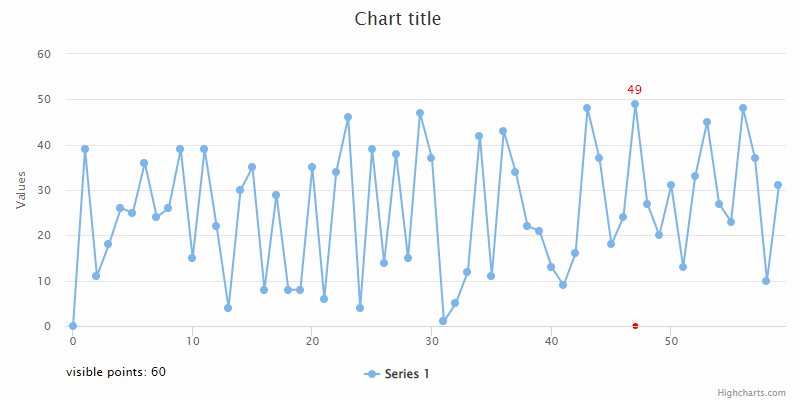

# Exercise 9 - Visible Points Zoom

Create a line chart with 100 random integer values (`0 < y < 100`) and ‘xy’ zoom. Render a “Visible points: n” label where `n` is a number of visible points on each zoom level. For the points with the highest value, add a red label with its `y` value and render a red dot on the xAxis exactly below the point. Take into consideration that there might be multiple highest points. All the above should work on each zoom level.

