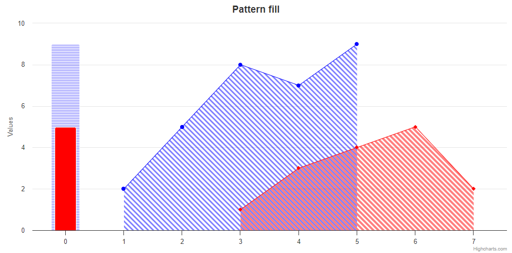

# Exercise 10 - Fill Patterns

Create a chart with custom pattern fills similar to the one in the photo below. Notice how the area series overlap with each other. Also add column series in such a way that the one with the pattern is behind the solid one.

