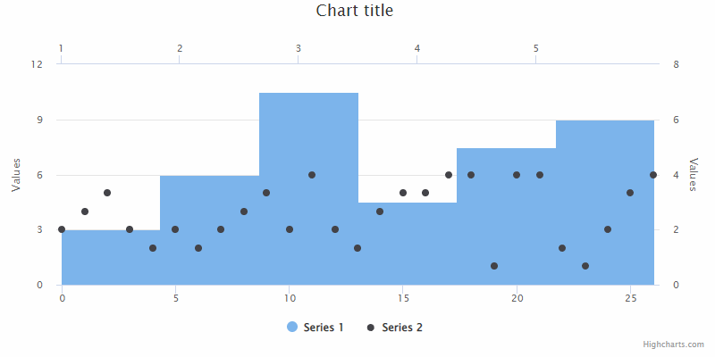

# exercise 10

--- Easy part
Create a `scatter` series with following data: `[3, 4, 5, 3, 2, 3, 2, 3, 4, 5, 3, 6, 3, 2, 4, 5, 5, 6, 6, 1, 6, 6, 2, 1, 3, 5, 6]`.
Create a `histogram` series based on the above scatter and connect newly created histogram to a separate axes (x and y).
Enable "point select" and disable an inactive state, change the color of histogram point when it's state is "select".
Link the series, so that there is only one legend item which shows/hides both of them on a single click.

--- Main task
When clicking on bin, select all points belonging to that bin - see below GIF for a reference.

