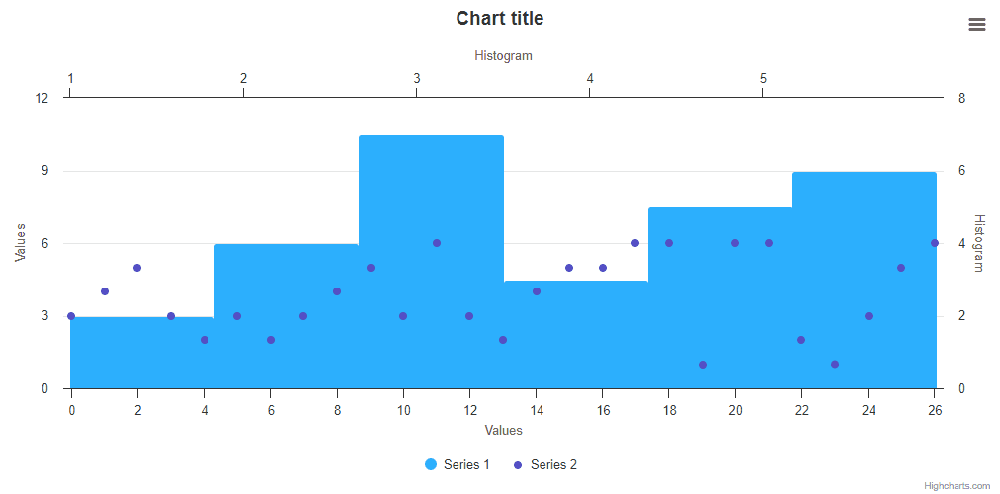

# Exercise 12 - Histogram Point Select

Create a chart with a following configuration:
* Series of type `scatter` which is plotting the following dataset:
```js
data: [3, 4, 5, 3, 2, 3, 2, 3, 4, 5, 3, 6, 3, 2, 4, 5, 5, 6, 6, 1, 6, 6, 2, 1, 3, 5, 6]
```
* Series of type `histogram`, which is based on the previous series. This series should be plotted on different `x` and `y` axes.
* Enable `point.select`
* disable an inactive state.
* change the color of histogram point when its state is `select`
* Link the series to each other, so that they are displayed as a single legend point.

After creating the chart described above, please implement the following functionality:

When clicking on a bin, select all points belonging to that bin.
see below GIF for a reference.

