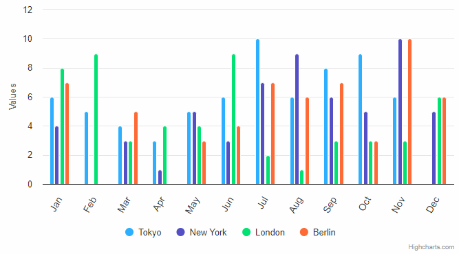

# Exercise 13 - Hover Label Highlight

- Create a chart similar to the one in the GIF.
- Add logic for highlighting ```xAxis.labels``` when hovering over above columns group.
- Modify the fading effect to highlight only the columns of the hovered group.


