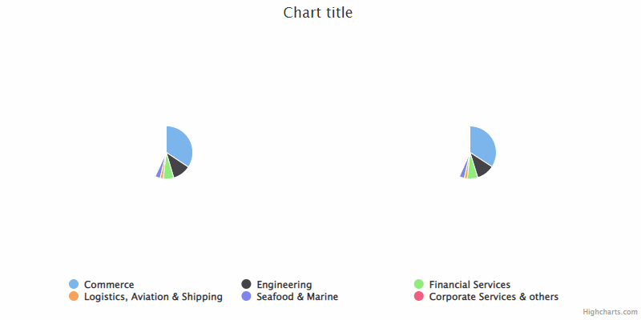

# exercise 13

Create two pie series with one common legend. Hide all points with the same name on legend click, see GIF below. Also, display the tooltip and set a `hover` state for common points when hovering.

