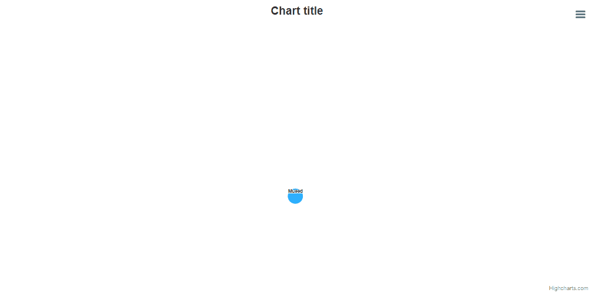

# Exercise 15 - Networkgraph Collapse

Create a networkgraph with a possibility to collapse nodes, so the children will show / hide after click on the parent nodes. Remember, that the node collapse should work recursively, which means, that if you click on the parent node, not only the child nodes should be hidden, but also the childrens' children should be hidden.

