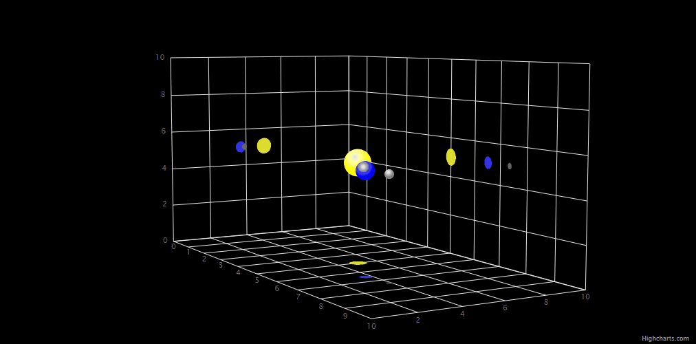

# Exercise 19 - 3D Scatter Planets

Use the 3D scatter series to build a simple visualization of the planet orbiting
the sun and the moon orbiting the planet. Find an external Highcharts plugin
that offers drawing projections of 3D points on axes and implement it into the
exercise. Make sure the presented chart is legible, i.e. all points are visible.
Use a gradient to make the 3D points look more like spheres.

