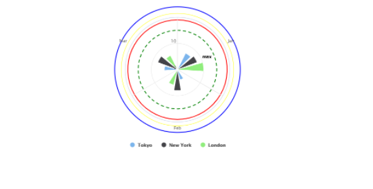

# exercise 2

Based on the demo, that you created in the [exercise 1](https://github.com/blacklabel/highcharts-fundamentals/tree/main/highcharts-api/highcharts/1-simple-column), create a similar chart, but using the polar coordinates. Figure out additional ways of creating the additional circles in a different ways, similar to the ones, that you can use in the exercise below.

