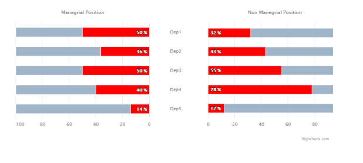

# exercise 4

Create a bar chart with two separate red series on the separate axes, see an image below.

Remember that:
1. Labels between the series (Dep1, Dep2...) should be centered.
2. The whole chart should be responsive. 

