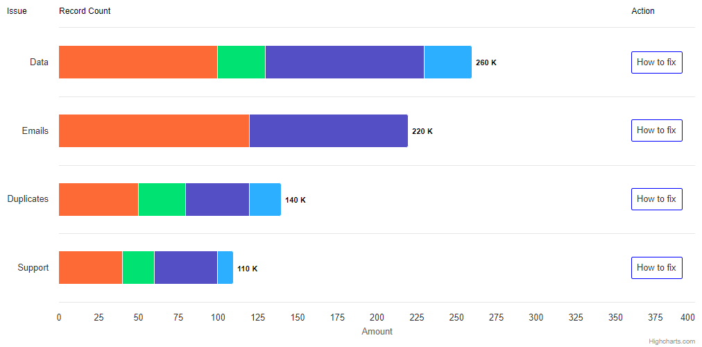

# highcharts/6-stacked-bar

Create a stacked bar chart as shown in the below image. Add custom text labels ("Issue", "Recond Count", "Action") and custom buttons ("How to fix") using SVGRenderer and make sure that the graph still looks good when you change the screen width.

