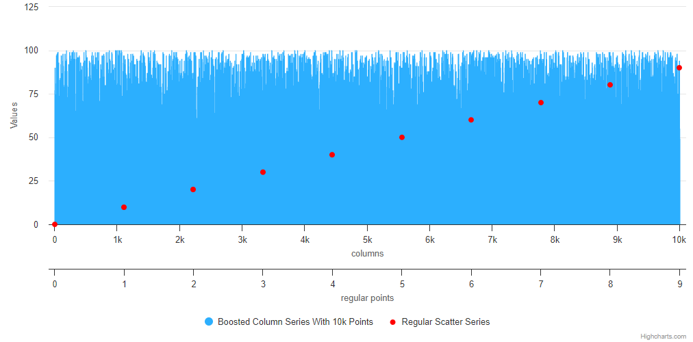

# highcharts/7-boosted-chart

Sometimes it happens that charts need to contain so much data that they require
a change in the rendering method to achieve satisfactory performance. Find a way
to boost the chart so that you can generate a similar to the one shown below.

The chart should contain two series:
* the one boosted colum series with at least 10k points,
* the other - regular scatter series. Be sure that the second series will not be
boosted.

