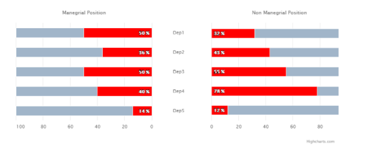

# highcharts/8-separate-axes

Create a bar chart with two separate red series on the separate axes, see an image below.

Remember that:

- Labels between the series (Dep1, Dep2...) should be centered.
- The whole chart should be responsive.
- Axis titles should be positioned using properties from the API.
- Don't forget about the gray background for bars.

