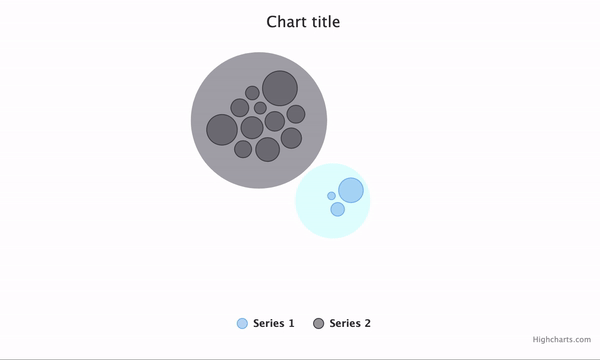
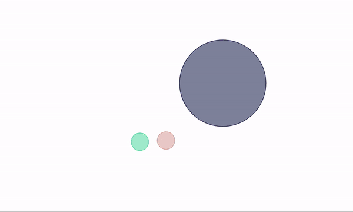

# exercise 8

1 part: Create a split packed bubble chart with 2 series of random data. Then create a possibility to automatically move bubbles between series without a need for the whole chart to draw from scratch.

2 part: Create a packed bubble chart with 1 series of random data. Then, randomly change a color of the bubble every time when it collides with the other bubbles.

3 part: Repeat the same excercise as `2`, but only for parent nodes.

Explain the behaviour of bubbles on the chart, describe how the colors are changing.

4 part (Optional): Change bounding box limiting movement of the bubbles to a triangle.
